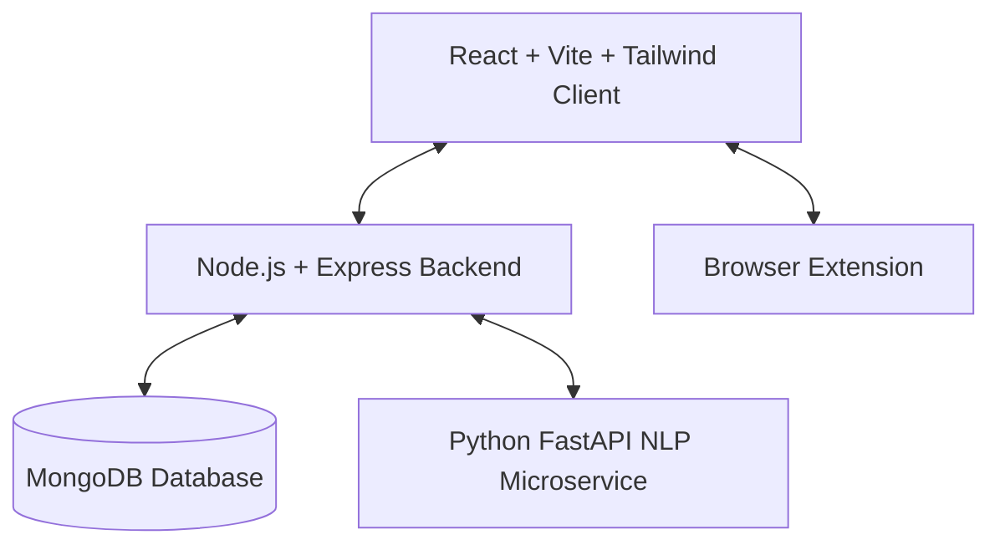

# JobShield AI 🛡️

JobShield AI is a modern, production-ready, full-stack cybersecurity application designed to detect and prevent job recruitment scams, fake internships, salary anomalies, and phishing recruitment emails. The platform empowers job seekers—especially students—to audit listings and recruiters in real-time.

---

## 🚀 Live Deployments

- **Web Application (Frontend)**: [https://jobshield-ai-phi.vercel.app](https://jobshield-ai-phi.vercel.app)
- **API Server (Express Backend)**: [https://jobshield-ai-i679.onrender.com](https://jobshield-ai-i679.onrender.com)
- **NLP Service (FastAPI Microservice)**: [https://jobshield-fastapi.onrender.com](https://jobshield-fastapi.onrender.com)

---

## Technical Stack & Architecture



- **Frontend**: React, Vite, Tailwind CSS v3, Recharts, Framer Motion
- **Backend API**: Node.js, Express, Mongoose (MongoDB), Multer, PDF-Parse
- **NLP Microservice**: Python FastAPI, Uvicorn, Heuristic Threat Scoring
- **Browser Integration**: Chrome Extension (Manifest v3)

---

## Core Features

- **Job Description Scan**: Upload text or documents (PDF, TXT, DOCX) to analyze grammatical structures, suspect messaging migrations (Telegram/WhatsApp), and financial requests.
- **Phishing Email Scanner**: Paste recruiter messages to audit link safety and check if domains mimic corporate entities.
- **Salary Anomaly Audit**: Plot market standards against job offers using Recharts to identify unrealistic pay-rates used as bait.
- **Student Reviews Portal**: Anonymously rate internships and employers. Submissions go through an admin moderation queue before publication.
- **Unified Dashboard**: Tracks logged threat metrics, scan histories, and average risk indices.
- **Admin Moderation Panel**: Approve/reject/delete student warning reviews and monitor live network statistics.
- **Browser Extension**: Highlight text on LinkedIn, Indeed, or Gmail, right-click, and scan instantly.

---

## Project Structure

```text
├── backend/            # Express.js REST API
│   ├── config/         # DB connection setup
│   ├── controllers/    # Route controllers (Auth, Scans, Reviews, Admin)
│   ├── middleware/     # JWT security & role checks
│   ├── models/         # MongoDB Mongoose schemas
│   └── routes/         # Router declarations
├── fastapi_service/    # Python NLP engine
│   ├── main.py         # API router setup
│   ├── scam_detector.py
│   ├── phishing_detector.py
│   └── salary_analyzer.py
├── frontend/           # React client
│   ├── src/
│   │   ├── components/ # Header, Footer, and Common UI
│   │   ├── context/    # JWT & Theme Context
│   │   ├── pages/      # 10 pages (Landing, Audit, Dashboard, Admin, etc.)
│   │   └── App.jsx     # Route mappings
├── extension/          # Manifest V3 browser extension
└── setup.bat           # Automated npm package setup script
```

---

## Local Installation Guide

### Prerequisites
- [Node.js](https://nodejs.org) (v18+)
- [Python 3.8+](https://python.org)
- [MongoDB](https://mongodb.com) running locally (default: `mongodb://127.0.0.1:27017/jobshield_ai`)

### 1. Set Up Dependencies
Double-click `setup.bat` in the root folder, or run the following commands manually:
```bash
# Install root orchestrators
npm install

# Install backend dependencies
cd backend
npm install

# Install frontend dependencies
cd ../frontend
npm install
```

### 2. Configure Python Microservice
Install required NLP and FastAPI frameworks:
```bash
pip install fastapi uvicorn pydantic
```

### 3. Run the Services Concurrently
From the root directory, launch the entire MERN + FastAPI stack with:
```bash
npm run dev
```
- **React Frontend**: [http://localhost:5173](http://localhost:5173)
- **Express Backend API**: [http://localhost:5000](http://localhost:5000)
- **FastAPI NLP Engine**: [http://127.0.0.1:8000](http://127.0.0.1:8000)

---

## Seed Accounts (Admin & Companies)
Upon starting, the backend automatically seeds initial test data if your database is empty:
- **Admin Login**:
  - Email: `admin@jobshield.ai`
  - Password: `adminpassword123`
- **Whitelisted Companies**: Google, Microsoft, Amazon.
- **Flagged Entities**: Telegram Job Scam Mimic.

---

## Browser Extension Setup
1. Open Chrome and navigate to `chrome://extensions/`.
2. Toggle **Developer Mode** (top-right corner).
3. Click **Load unpacked** and select the `/extension` folder from this project directory.
4. Highlight any text on a webpage, right-click, and click **Scan Selection with JobShield AI**.

---

## Developed By

**PODUGU MUKESH**  
- **Email**: [mukeshpodugu123@gmail.com](mailto:mukeshpodugu123@gmail.com)  
- **Phone**: 8143999463  
- **LinkedIn**: [podugu-mukesh-1575a32b4](https://www.linkedin.com/in/podugu-mukesh-1575a32b4/)  
- **GitHub**: [mukeshpodugu](https://github.com/mukeshpodugu)
